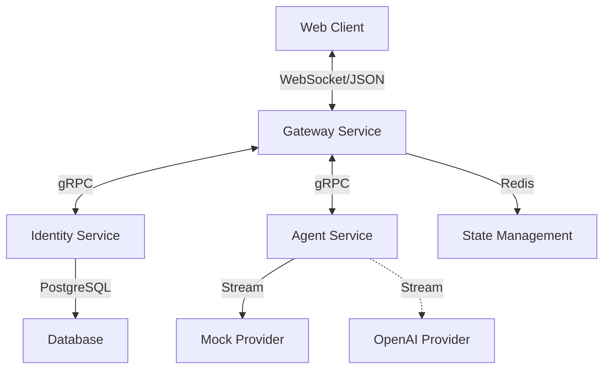

# Go AI Gateway

English | [简体中文](README_zh.md)

[](https://goreportcard.com/report/github.com/yeliheng/go-ai-gateway)
[](LICENSE)

> An enterprise-grade, extensible WebSocket Gateway developed in Go, designed to manage high-concurrency AI conversations.

## 📚 Project Overview

This project serves as a **cloud-native AI Gateway** reference implementation. It acts as a middleware between client applications (Web/Mobile) and downstream AI services (Mock, OpenAI, etc.), handling:

- **WebSocket Connection Management**: Efficiently upgrades and manages persistent connections.
- **Protocol Standardization**: Unified JSON-based messaging protocol.
- **Message Routing**: Intelligent dispatching to different AI providers.
- **Microservices Architecture**: Split into Gateway, Identity, and Agent services for scalability.
- **Observability**: Integrated with OpenTelemetry and Jaeger for distributed tracing.

## 🏗 Architecture

The gateway follows a clean, modular microservices architecture:



### Key Components

- **Gateway Service** (`cmd/gateway`): Handles WebSocket connections, protocol parsing, and request routing.
- **Identity Service** (`cmd/identity`): Manages user authentication and user data.
- **Agent Service** (`cmd/agent`): Interfaces with AI providers (LLMs) and manages conversation logic.
- **Biz/Admin Service** (`cmd/biz`): Business logic and administrative functions.

## 🚀 Getting Started

### Prerequisites

- Go 1.20+
- Docker & Docker Compose (Recommended)
- Redis and PostgreSQL (for local run without Docker)

### Installation

```bash
# Clone the repository
git clone https://github.com/yeliheng/go-ai-gateway.git
cd go-ai-gateway

# Install dependencies
go mod tidy
```

### Running with Docker Compose (Recommended)

The easiest way to start the entire system (Gateway, Identity, Agent, Redis, Postgres, Jaeger) is using Docker Compose.

```bash
docker-compose up -d
```
Services will be available at:
- **Gateway**: `ws://localhost:8080`
- **Jaeger UI**: `http://localhost:16686`

### Running Locally

If you prefer to run services individually:

1. **Start Infrastructure** (Redis, Postgres, Jaeger):
   ```bash
   docker-compose up -d redis postgres jaeger
   ```

2. **Run Services** (in separate terminals):
   ```bash
   # Start Identity Service
   go run cmd/identity/main.go
   
   # Start Agent Service
   go run cmd/agent/main.go
   
   # Start Gateway Service
   go run cmd/gateway/main.go
   ```

### Using the Demo

1. Open `web/index.html` in your browser.
2. Enter a Token (e.g., `123`).
3. Click **Connect**.
4. Type a message and send.
5. Watch the AI response stream back.

## 📡 Protocol

### Request (Client -> Server)

```json
{
  "type": "chat",
  "payload": {
    "content": "Hello AI",
    "model": "mock"
  }
}
```

### Response (Server -> Client)

```json
{
  "type": "chat",
  "payload": {
    "content": "H",
    "model": "mock"
  }
}
```
*(Server streams response character by character)*

## 🛠 Future Roadmap

- [ ] **Multi-Cluster Deployment**: More robust multi-cluster gateway services.
- [ ] **Circuit Breaker**: Protect downstream AI services.
- [ ] **Advanced Rate Limiting**: Token bucket/sliding window algorithms.
- [ ] **More Providers**: Anthropic, Google Gemini integration.
- [ ] **Dashboard**: Admin UI for monitoring connections.

## 🤝 Contributing

Contributions are welcome! Please feel free to submit a Pull Request.

## 📄 License

This project is open-sourced software licensed under the [MIT license](LICENSE).
