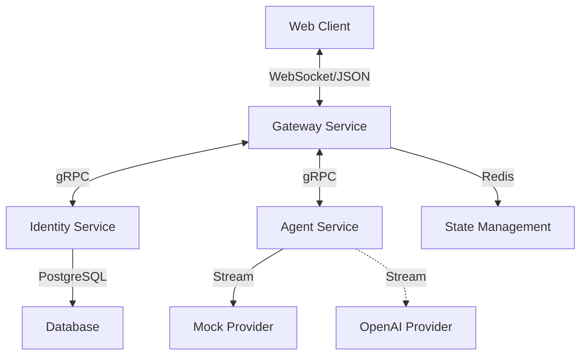

# Go AI Gateway

[English](README.md) | 简体中文

[](https://goreportcard.com/report/github.com/yeliheng/go-ai-gateway)
[](LICENSE)

> 一个企业级、可扩展的 WebSocket 网关，使用 Go 语言开发，专为管理高并发 AI 对话而设计。

## 📚 项目概览

本项目是一个**云原生 AI 网关**的参考实现。它作为客户端应用（Web/移动端）与下游 AI 服务（Mock, OpenAI 等）之间的中间件，主要处理：

- **WebSocket 连接管理**：高效升级和管理持久连接。
- **协议标准化**：统一的基于 JSON 的消息协议。
- **消息路由**：智能分发到不同的 AI 提供商。
- **微服务架构**：拆分为网关、身份认证和 Agent 服务，以支持弹性伸缩。
- **可观测性**：集成 OpenTelemetry 和 Jaeger 进行分布式链路追踪。

## 🏗 架构

网关遵循清晰、模块化的微服务架构：



### 核心组件

- **Gateway Service** (`cmd/gateway`)：处理 WebSocket 连接、协议解析和请求路由。
- **Identity Service** (`cmd/identity`)：管理用户认证和用户数据。
- **Agent Service** (`cmd/agent`)：对接 AI 提供商 (LLMs) 并管理对话逻辑。
- **Biz/Admin Service** (`cmd/biz`)：业务逻辑和管理功能。

## 🚀 快速开始

### 前置要求

- Go 1.20+
- Docker & Docker Compose (推荐)
- Redis 和 PostgreSQL (如果本地直接运行)

### 安装

```bash
# 克隆仓库
git clone https://github.com/yeliheng/go-ai-gateway.git
cd go-ai-gateway

# 安装依赖
go mod tidy
```

### 使用 Docker Compose 运行 (推荐)

启动整个系统（Gateway, Identity, Agent, Redis, Postgres, Jaeger）的最简单方法是使用 Docker Compose。

```bash
docker-compose up -d
```
服务启动后可通过以下地址访问：
- **Gateway**: `ws://localhost:8080`
- **Jaeger UI**: `http://localhost:16686`

### 本地运行

如果你偏好单独运行各个服务：

1. **启动基础设施** (Redis, Postgres, Jaeger):
   ```bash
   docker-compose up -d redis postgres jaeger
   ```

2. **运行服务** (在不同的终端窗口中):
   ```bash
   # 启动身份认证服务
   go run cmd/identity/main.go
   
   # 启动 Agent 服务
   go run cmd/agent/main.go
   
   # 启动网关服务
   go run cmd/gateway/main.go
   ```

### 使用演示 Demo

1. 在浏览器中打开 `web/index.html`。
2. 输入 Token (例如: `123`)。
3. 点击 **Connect** (连接)。
4. 输入消息并发送。
5. 观察 AI 的流式响应。

## 📡 协议

### 请求 (Client -> Server)

```json
{
  "type": "chat",
  "payload": {
    "content": "Hello AI",
    "model": "mock"
  }
}
```

### 响应 (Server -> Client)

```json
{
  "type": "chat",
  "payload": {
    "content": "H",
    "model": "mock"
  }
}
```
*(服务端会逐字符流式返回响应)*

## 🛠 规划

- [ ] **多集群部署**: 更加丰富的多集群网关服务
- [ ] **熔断器**: 保护下游 AI 服务。
- [ ] **更多模型支持**: 集成 Anthropic, Google Gemini。
- [ ] **监控面板**: 连接管理 Admin UI。

## 🤝 贡献

欢迎提交 Pull Request 参与贡献！

## 📄 许可证

本项目基于 [MIT license](LICENSE) 开源。
